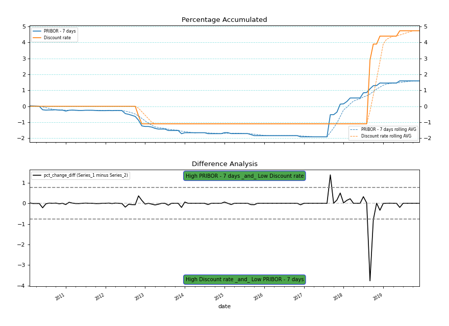

## Gaussian distribution 

> Pairs Trade are good for the identification of non-equilibrium stage in short-term between cointegrate variables. Since cointegrated variables have a long-term stationery relationship (or integrated with lower order), this can be used as a decision-maker trigger. It is commonly used in the financial market.

- ADF - Dicky-Fuller test  - Stationarity of Time Series
- Johanson's Cointegration Test
- Cointegration test - ADF test on Resids from OLS regression between series
- Pairs Trade 

**Required libraries**: *statsmodels, itertools, numpy, pandas, matplotlib*

