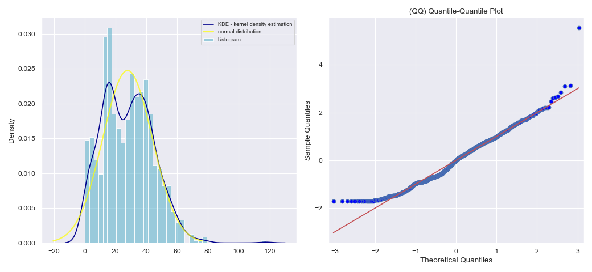

## Gaussian distribution 

> This python function to evidence if sample follows a Gaussian distribution (Normal distribution)

- Shapiro-Wilk test
- Anderson-Darling test
- Quantile-Quantile Plot (Q-Q plot)
- Kernel Density Estimation (KDE)
- Gaussian distribution 
- Histogram

**Required libaries**: *scipy, statsmodels, numpy, seaborn, math ,pandas, matplotlib*

