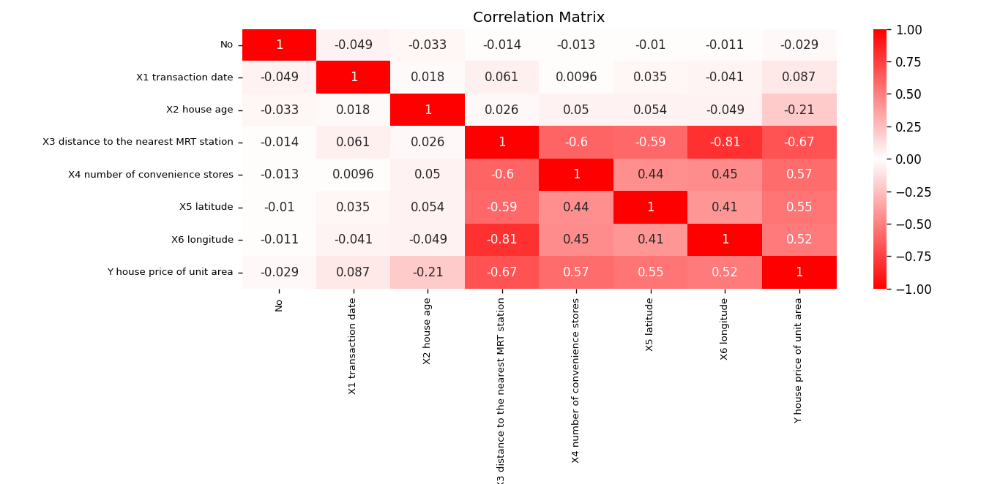

## Code

>This python function provides a good visualization to analyse correlation between columns in the a dataframe

- Pearson Correlation 
- Create color map
- Heatmap seaborn

**Required libraries**: seaborn, pandas, matplotlib*

